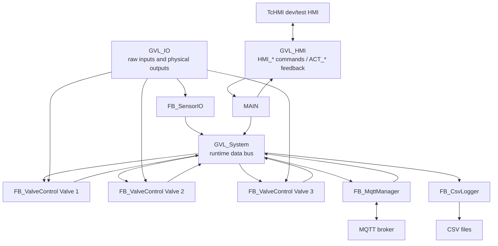
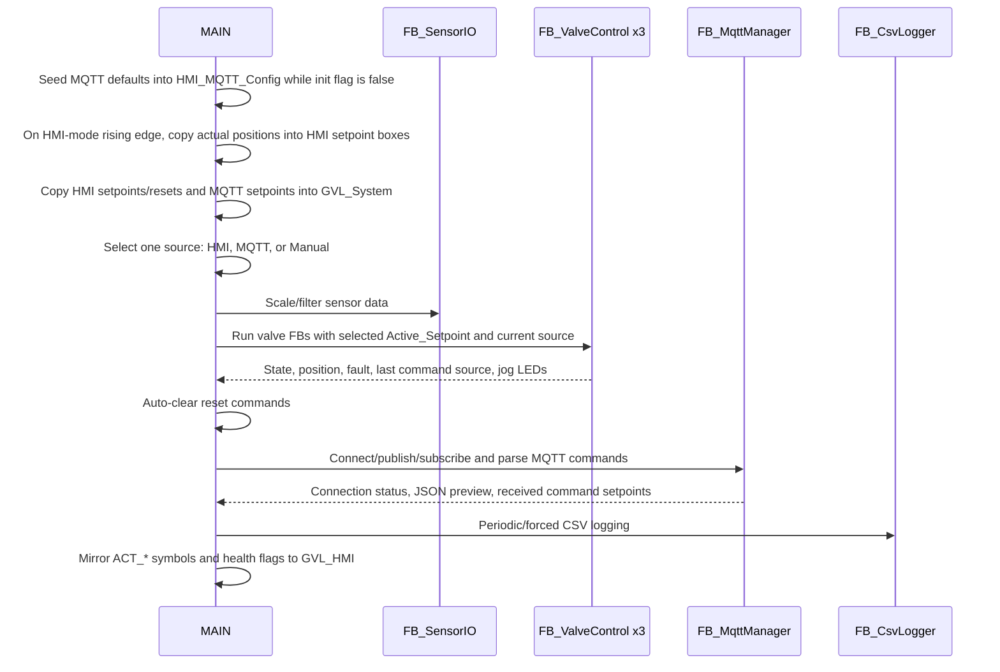

# Architecture

## Scope

The PLC project is organized around one top-level program, five function blocks, four GVLs, and the DUTs under `State_Var`. `MAIN` is the cycle conductor: it copies HMI/runtime data, selects the command source, runs the function blocks, and mirrors feedback back to TcHMI symbols.

## Runtime modules

| Module | Type | File | Responsibility |
| --- | --- | --- | --- |
| `MAIN` | PROGRAM | `XAE/VekSi_PLC/Functions/MAIN.TcPOU` | Orchestrates every PLC cycle, performs command-source arbitration, calls FBs, mirrors status |
| `FB_ValveControl` | FB | `XAE/VekSi_PLC/Functions/FB_ValveControl.TcPOU` | Per-valve motion, homing, halt, fault/reset, manual jog and jog LEDs |
| `FB_SensorIO` | FB | `XAE/VekSi_PLC/Functions/FB_SensorIO.TcPOU` | Raw sensor input scaling, filtering, and fault flags |
| `FB_MqttManager` | FB | `XAE/VekSi_PLC/Functions/FB_MqttManager.TcPOU` | MQTT connect/reconnect, auto-subscribe, command parsing, status publish |
| `FB_CsvLogger` | FB | `XAE/VekSi_PLC/Functions/FB_CSVLogger.TcPOU` | Monthly CSV file creation, headers, row writes, forced writes |

## Data flow

## GVL roles

| GVL | Main writer | Main readers | Purpose |
| --- | --- | --- | --- |
| `GVL_Config` | Constants | `MAIN`, FBs | Compile-time configuration: stroke, motion, sensor scaling, MQTT defaults, CSV path |
| `GVL_IO` | EtherCAT mapping / valve FB LED outputs | `FB_SensorIO`, `FB_ValveControl` | Physical raw inputs, limit switches, jog buttons, jog LEDs |
| `GVL_System` | `MAIN` and FBs | `MAIN`, MQTT, CSV | Runtime bus for valve data, sensor data, command-update edges, health flags |
| `GVL_HMI` | TcHMI for `HMI_*`; PLC for `ACT_*` | `MAIN`, TcHMI | HMI/PLC interface symbols |

## PLC cycle order

## Command-source arbitration

Command selection is now **system-wide** through `GVL_HMI.HMI_CommandSource`:

| Selected source | Active setpoint source | Update edge | Notes |
| --- | --- | --- | --- |
| `E_CommandSource.HMI` | `HMI_ValveN_Setpoint` | `HMI_UPDATE` | Test HMI numeric boxes drive all valves when Update is pressed |
| `E_CommandSource.MQTT` | Last parsed MQTT `ValveN` values | `fbMqttManager.bNewRemoteCommand` | Only applied while MQTT is enabled and connected |
| `E_CommandSource.Manual` | `Manual_Setpoint` / jog behavior | none for absolute move | Valve FB enters `MANNUAL_JOG`; physical jog buttons move valves while held |

`FB_ValveControl` no longer chooses between HMI and MQTT itself. It receives an already selected `Active_Setpoint` and `currentcommandsrc` from `MAIN`, clamps the selected setpoint, and uses the source for `lastcommandsrc` while moving or jogging.

## Development HMI status

The current HMI view is intentionally a **development/test HMI**. It exposes raw controls and diagnostics for setpoints, mode radio buttons, MQTT publish/enable actions, forced CSV write, a file browser area, and EtherCAT diagnostics. Treat the attached screenshot as a test bench layout, not the final production HMI design.
