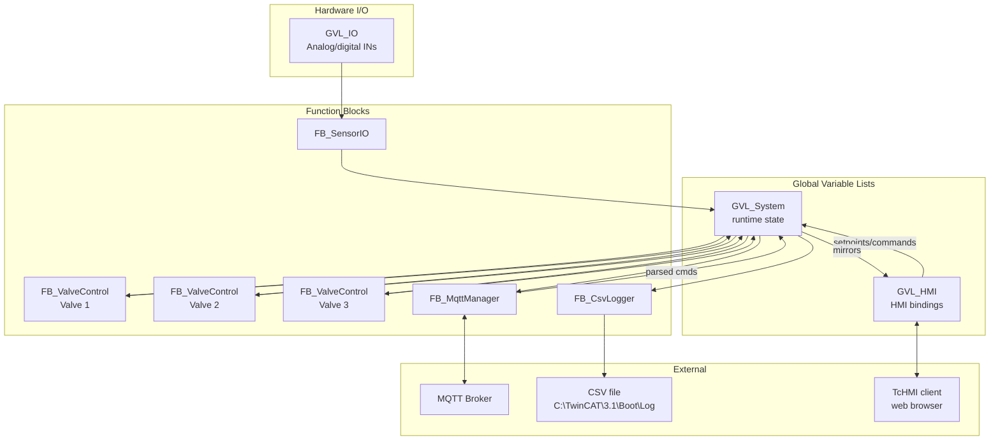
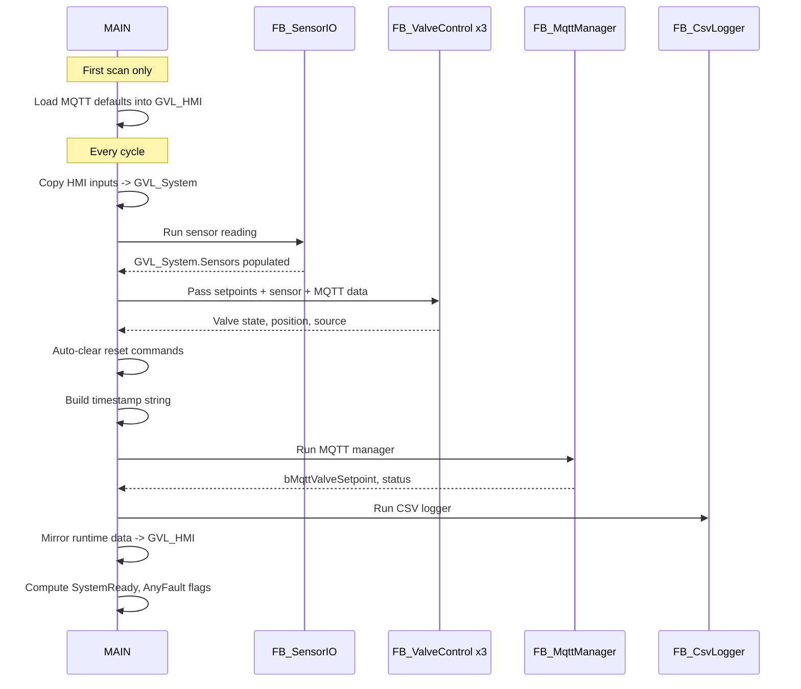
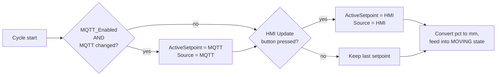

# Architecture

## Module overview

The PLC project consists of **5 function blocks** orchestrated by `MAIN`,
plus 4 GVLs and 6 user-defined types.

| Module             | Type | File                                     | Responsibility                                                  |
| ------------------ | ---- | ---------------------------------------- | --------------------------------------------------------------- |
| `MAIN`             | PRG  | `Functions/MAIN.TcPOU`                   | Orchestrate FBs, copy data between GVLs                         |
| `FB_ValveControl`  | FB   | `Functions/FB_ValveControl.TcPOU`        | Per-valve TC2_MC2 state machine (instantiated 3x)               |
| `FB_SensorIO`      | FB   | `Functions/FB_SensorIO.TcPOU`            | Read raw analog inputs, scale, filter, fault-detect             |
| `FB_MqttManager`   | FB   | `Functions/FB_MqttManager.TcPOU`         | TF6701 MQTT client; publish + subscribe + JSON                  |
| `FB_CsvLogger`     | FB   | `Functions/FB_CSVLogger.TcPOU`           | Monthly CSV log file; cyclic and forced row writes              |

## Data-flow diagram

## GVL responsibilities

| GVL          | Owner / writer        | Reader                         | Purpose                                  |
| ------------ | --------------------- | ------------------------------ | ---------------------------------------- |
| `GVL_Config` | (constant)            | All FBs                        | Compile-time tunables                    |
| `GVL_IO`    | EtherCAT I/O mapping  | `FB_SensorIO`, `FB_ValveControl` | Raw analog/digital inputs              |
| `GVL_System` | All FBs               | `MAIN`                         | Runtime shared state                     |
| `GVL_HMI`    | `MAIN` (ACT_*) / TcHMI (HMI_*) | All FBs               | HMI <-> PLC interface                    |

## Cycle order in `MAIN`

## Setpoint arbitration (per valve)

`FB_ValveControl` decides which setpoint to follow:

HMI always wins if both arrive in the same PLC cycle.

## Source-of-truth conventions

- **Operator inputs** flow `GVL_HMI.HMI_*` -> `GVL_System.Valve[n]`
- **PLC outputs** flow `GVL_System.Valve[n]` -> `GVL_HMI.ACT_*`
- **MQTT data** uses `GVL_System.MQTT_*` as the runtime mirror
- **Sensor data** uses `GVL_System.Sensors` (struct) for all consumers
