# Code Walkthrough — Learning Guide

A complete, top-to-bottom explanation of the irrigation PLC code,
written for someone who wants to **read, understand, and modify it
themselves**. Every diagram below is Mermaid; GitHub will render it
inline.

If something here feels too basic, skip ahead. If something feels
too dense, jump to "How to make common changes" at the end and
work backwards.

---

## Table of contents

1. [What the system does (big picture)](#1-what-the-system-does-big-picture)
2. [Hardware layout](#2-hardware-layout)
3. [Software layer cake](#3-software-layer-cake)
4. [File / folder map](#4-file--folder-map)
5. [The three "buses": GVL_IO, GVL_System, GVL_HMI](#5-the-three-buses-gvl_io-gvl_system-gvl_hmi)
6. [Data types (DUTs)](#6-data-types-duts)
7. [MAIN — the cycle conductor](#7-main--the-cycle-conductor)
8. [FB_SensorIO — raw counts → engineering units](#8-fb_sensorio--raw-counts--engineering-units)
9. [FB_ValveControl — the 8-state motion machine](#9-fb_valvecontrol--the-8-state-motion-machine)
10. [FB_MqttManager — broker connection + JSON](#10-fb_mqttmanager--broker-connection--json)
11. [FB_CsvLogger — non-blocking file I/O](#11-fb_csvlogger--non-blocking-file-io)
12. [End-to-end data flow](#12-end-to-end-data-flow)
13. [HMI interaction flow](#13-hmi-interaction-flow)
14. [Cycle timing & determinism](#14-cycle-timing--determinism)
15. [How to make common changes](#15-how-to-make-common-changes)
16. [Glossary of ST / PLCopen terms](#16-glossary-of-st--plcopen-terms)

---

## 1. What the system does (big picture)

This project controls **3 irrigation gate valves** mounted on a
water tank/canal. Each valve has a stepper-driven actuator that
opens it from 0 % (closed) to 100 % (fully open). The system also
reads **water level** and **two temperature** sensors, logs data
to CSV every 15 minutes, and exposes everything over **MQTT** for
remote monitoring/control plus a local **TcHMI** web dashboard.

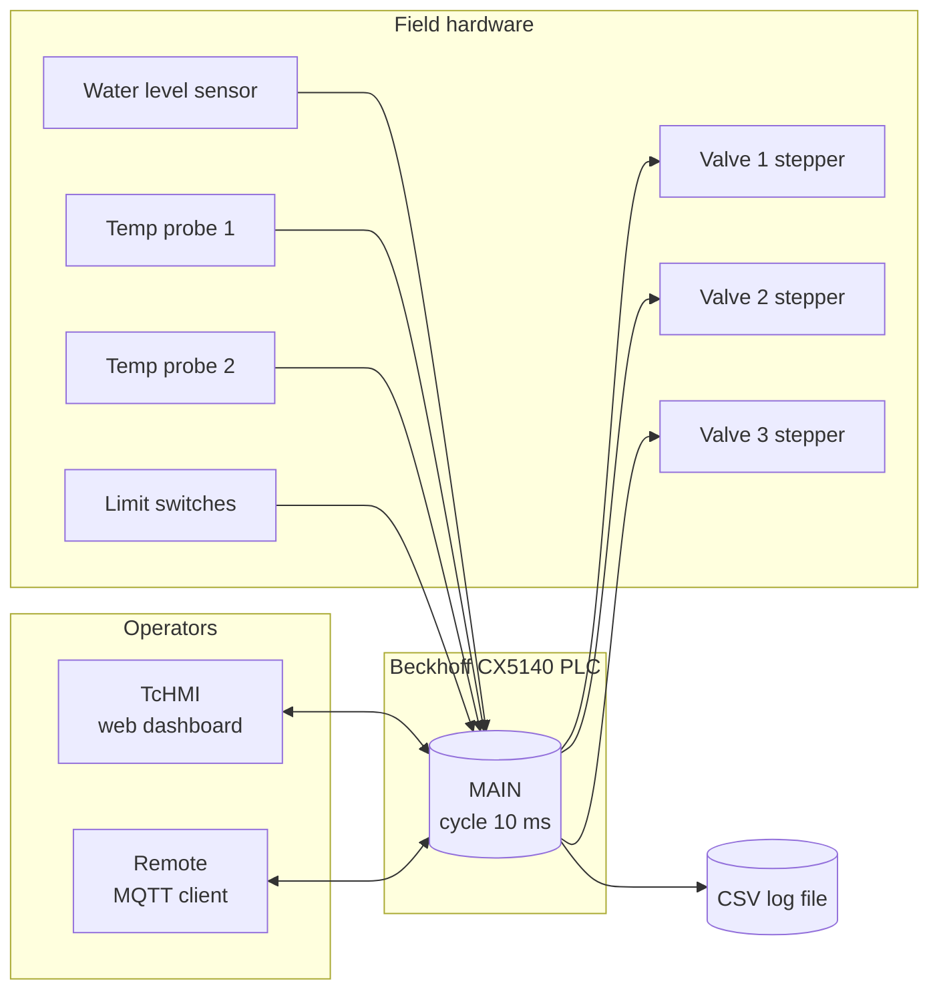

Everything you'll read about below boils down to **this picture**:
inputs from operators and sensors come in, valves move and data
gets logged/published as a result.

---

## 2. Hardware layout

Knowing the hardware makes the GVL_IO declarations make sense.

| Slot | Module        | What it does                                |
| ---- | ------------- | ------------------------------------------- |
| 100  | PS2001-2410   | 24 V DC power supply                        |
| 200  | CX5140        | The PLC itself (runs TwinCAT XAR)           |
| 300  | EK1521-0010   | EtherCAT fibre coupler                      |
| 400  | EL1859        | 16× digital I/O (limit switches, lamps)     |
| 500  | EL3202        | 2× PT100 RTD inputs (temperature)           |
| 600  | EL1004        | 4× digital input                            |
| 700  | EL3074        | 4× analog input 4–20 mA (water level + spares) |
| 800  | EK1322        | EtherCAT P junction                         |
| 900  | EL9011        | EtherCAT bus end terminal                   |
| 1000–1200 | EPP7041-1002 | 3× stepper drives (one per valve)        |

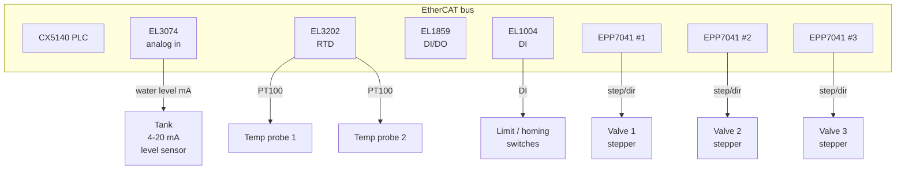

Each stepper has its own **NC axis** in TwinCAT motion configuration.
The PLC code talks to the axis through `AXIS_REF` references.

---

## 3. Software layer cake

The code is organised in clear layers. Each layer only talks to
the next one, never skipping levels.

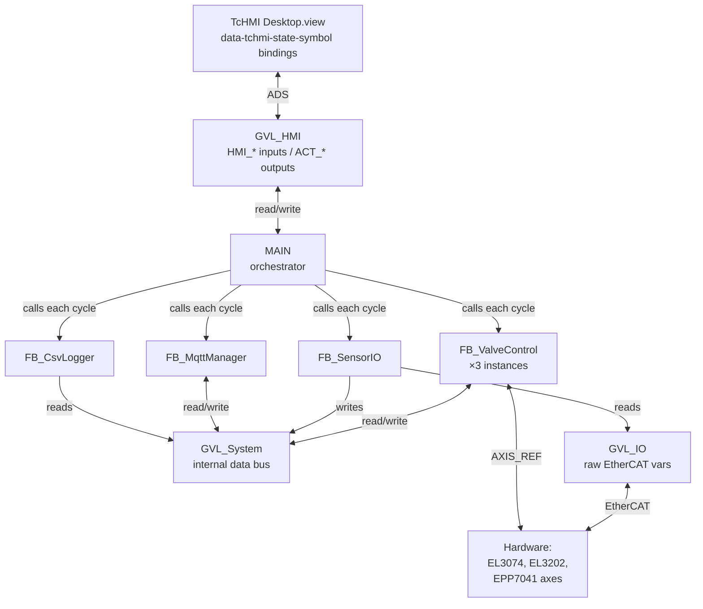

**Why layers?** Anything you change in one layer (e.g. swap the
HMI for a different one) leaves all the others untouched. The
GVLs are the contracts between layers.

---

## 4. File / folder map

```text
Veksi_Project/
├── XAE/VekSi_PLC/                   ← TwinCAT PLC project
│   ├── Functions/                   ← Programs and Function Blocks
│   │   ├── MAIN.TcPOU               ← Main program (orchestrator)
│   │   ├── FB_ValveControl.TcPOU    ← One per valve (instantiated 3×)
│   │   ├── FB_SensorIO.TcPOU        ← Sensor scaling + filtering
│   │   ├── FB_MqttManager.TcPOU     ← MQTT broker client
│   │   └── FB_CSVLogger.TcPOU       ← CSV file logger
│   ├── State_Var/                   ← Custom data types (DUTs)
│   │   ├── E_ValveState.TcDUT       ← enum: INIT/HOMING/IDLE/MOVING/...
│   │   ├── E_ValveSource.TcDUT      ← enum: HMI/MQTT/NONE
│   │   ├── E_CSVLogState.TcDUT      ← enum: CSV state machine
│   │   ├── ST_ValveData.TcDUT       ← struct: per-valve runtime data
│   │   ├── ST_SensorData.TcDUT      ← struct: scaled sensor data
│   │   ├── ST_MqttConfig.TcDUT      ← struct: broker settings
│   │   └── ST_MQTT_Command.TcDUT    ← struct: parsed incoming JSON
│   ├── Variables_Lists/             ← Global Variable Lists (GVLs)
│   │   ├── GVL_Config.TcGVL         ← Compile-time CONSTANTs
│   │   ├── GVL_IO.TcGVL             ← AT %I*/%Q* hardware variables
│   │   ├── GVL_System.TcGVL         ← Runtime shared state
│   │   └── GVL_HMI.TcGVL            ← HMI binding variables
│   └── VekSi_PLC.plcproj            ← Project manifest (lists all files)
│
├── HMI/                             ← TcHMI project
│   └── Desktop.view                 ← The dashboard layout + bindings
│
└── docs/                            ← Documentation (this folder)
    ├── ARCHITECTURE.md
    ├── STATE_MACHINES.md
    ├── HMI_FLOW.md
    ├── MQTT_PROTOCOL.md
    ├── CSV_FORMAT.md
    ├── SETUP.md
    ├── CONFIGURATION.md
    ├── CHANGELOG.md
    └── CODE_WALKTHROUGH.md          ← You are here
```

**Key idea:** the `.TcPOU`, `.TcDUT`, `.TcGVL` files are XML
wrappers. The real ST source code lives inside the `<![CDATA[ ... ]]>`
blocks. When you open the project in TwinCAT XAE, those blocks
are presented as a normal code editor.

---

## 5. The three "buses": GVL_IO, GVL_System, GVL_HMI

A **GVL** (Global Variable List) is just a collection of variables
visible to all POUs. Think of each GVL as a notice-board that
everyone in the project can read and write.

We use **four** GVLs. Three of them are "buses" (data flows
through them). The fourth (GVL_Config) is read-only constants.

```mermaid
flowchart LR
    subgraph Hardware
        HW[EtherCAT modules]
    end
    subgraph IOLayer["GVL_IO (hardware-mapped)"]
        IO[AI_L1V11<br/>AI_Tmp_1<br/>bBottom_position_1<br/>...]
    end
    subgraph SystemLayer["GVL_System (runtime state)"]
        SYS[Valve[1..3]<br/>Sensors<br/>MQTT_*<br/>CSV_*]
    end
    subgraph HMILayer["GVL_HMI (HMI bindings)"]
        HMI[HMI_Valve1_Setpoint<br/>ACT_Valve1_Position<br/>HMI_MQTT_Config<br/>...]
    end
    subgraph ConfigLayer["GVL_Config (CONSTANTs)"]
        CFG[VALVE_FULL_STROKE_MM<br/>WATER_LEVEL_RAW_MAX<br/>CSV_LOG_INTERVAL_S<br/>...]
    end

    HW <--> IO
    IO --> SYS
    SYS <--> HMI
    CFG -.read-only.-> SYS
    CFG -.read-only.-> HMI
```

### GVL_Config — the tunables

`{attribute 'qualified_only'}` followed by `VAR_GLOBAL CONSTANT`
means these values:

- Cannot change while the PLC is running.
- Must always be referenced as `GVL_Config.NAME` (no shortcuts).
- Live in flash; recompile to change them.

Categories:

| Group              | Examples                                         |
| ------------------ | ------------------------------------------------ |
| Valve motion       | `VALVE_FULL_STROKE_MM`, `VALVE_MOVE_VELOCITY`    |
| Sensor scaling     | `WATER_LEVEL_RAW_MIN`, `TEMP_RAW_SCALE_FACTOR`   |
| Fault detection    | `SENSOR_FAULT_THRESHOLD`                         |
| CSV logging        | `CSV_LOG_INTERVAL_S`, `CSV_FILE_PATH`            |
| MQTT defaults      | `MQTT_DEFAULT_BROKER_IP`, `..._PUBLISH_INTERVAL` |
| Task cycle         | `TASK_CYCLE_MS`                                  |

### GVL_IO — the wires

Every variable here has an `AT %I*` or `AT %Q*` decoration which
is the TwinCAT syntax for "link this to a real hardware channel
in the I/O Mapping screen". Without that link, the variable just
holds zero.

Common entries:

```iecst
AI_L1V11           AT %I*  : INT;   // EL3074 ch1 — water level raw
AI_Tmp_1           AT %I*  : INT;   // EL3202 ch1 — temp probe 1
AI_PosFeedback_1   AT %I*  : INT;   // optional supplementary AI
bBottom_position_1 AT %I*  : BOOL;  // limit switch / homing cam
```

The PLC code never writes to these; it just reads them.

### GVL_System — the internal data bus

This is where state lives at runtime. Every function block writes
its outputs here so MAIN (and other FBs) can read them.

```iecst
VAR_GLOBAL
    Valve            : ARRAY[1..3] OF ST_ValveData;  // FB_ValveControl
    Sensors          : ST_SensorData;                 // FB_SensorIO
    CSV_LastWriteTime, CSV_FileError, CSV_CurrentFile, ...  // FB_CsvLogger
    MQTT_Connected, MQTT_LastJsonStatus, MQTT_NewCommand, ... // FB_MqttManager
    SystemReady, AnyFaultActive, AnySensorFault       // computed in MAIN
END_VAR
```

**Ownership rule:** each field has exactly one writer (commented
in the GVL header). All other consumers only read. This avoids
the classic PLC bug where two POUs fight over the same variable.

### GVL_HMI — the HMI contract

This GVL is special: every variable is bound to a TcHMI control
through ADS symbol paths. Two prefixes:

| Prefix  | Direction              | Example                       |
| ------- | ---------------------- | ----------------------------- |
| `HMI_*` | HMI writes, PLC reads  | `HMI_Valve1_Setpoint` (input) |
| `ACT_*` | PLC writes, HMI reads  | `ACT_Valve1_Position` (gauge) |

This convention makes it crystal clear which side owns each
variable. If you add a new HMI control, follow the same naming.

---

## 6. Data types (DUTs)

DUTs (Data Unit Types) are user-defined enums and structs.

### Enums

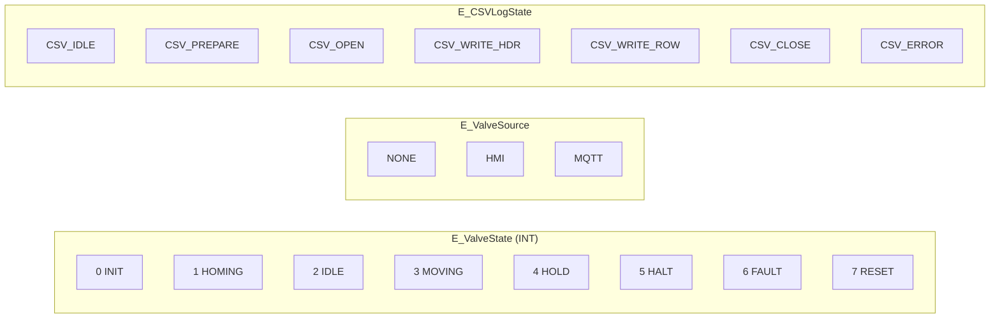

Why enums instead of magic numbers? The compiler catches typos
(`E_ValveState.IDLE` is checked; `2` is not), and the HMI / CSV
log can show the name.

### Structs

**ST_ValveData** — everything about one valve in one place:

```iecst
TYPE ST_ValveData :
STRUCT
    HMI_Setpoint     : REAL;          // 0–100 % from HMI
    MQTT_Setpoint    : REAL;          // 0–100 % from MQTT
    MQTT_Enabled     : BOOL;
    Reset_Cmd        : BOOL;
    Active_Setpoint  : REAL;          // whichever won arbitration
    Actual_Position  : REAL;          // 0–100 % feedback
    State            : E_ValveState;
    Source           : E_ValveSource;
    IsHomed          : BOOL;
    InPosition       : BOOL;
    IsFault          : BOOL;
    FaultCode        : UDINT;
END_STRUCT
END_TYPE
```

The big payoff: anywhere we need "all data for valve N" we just
write `GVL_System.Valve[N]` instead of 12 separate variables.

**ST_SensorData** — output of FB_SensorIO:

```iecst
TYPE ST_SensorData :
STRUCT
    rWaterLevel_pct     : REAL;
    rWaterLevel_mm      : REAL;
    rWaterLevel_raw     : INT;
    bWaterLevelFault    : BOOL;
    rTemperature_C      : ARRAY[1..2] OF REAL;
    rTemperature_raw    : ARRAY[1..2] OF INT;
    bTempFault          : ARRAY[1..2] OF BOOL;
    rPosFeedback_mm     : ARRAY[1..3] OF REAL;
    rPosFeedback_raw    : ARRAY[1..3] OF INT;
    bPosFeedbackFault   : ARRAY[1..3] OF BOOL;
    bAnySensorFault     : BOOL;
END_STRUCT
END_TYPE
```

**ST_MqttConfig** — runtime MQTT settings (HMI-editable):

```iecst
TYPE ST_MqttConfig :
STRUCT
    sBrokerAddress         : STRING(64);
    nPort                  : UINT;
    sClientId              : STRING(64);
    sUsername              : STRING(64);
    sPassword              : STRING(64);
    sTopicPrefix           : STRING(64);
    sMainTopic             : STRING(255);
    SubscribeTopic         : STRING(255);
    tStatusPublishInterval : TIME;
    tReconnectDelay        : TIME := T#5S;
    bUseStatusPublish      : BOOL;
END_STRUCT
END_TYPE
```

**ST_MQTT_Command** — schema for the **incoming** JSON payload.
Beckhoff's `FB_JsonReadWriteDatatype.SetSymbolFromJson` deserialises
JSON into a PLC struct of this exact shape:

```iecst
TYPE ST_MQTT_Command :
STRUCT
    Valve1        : DINT;     // setpoint 0..100
    Valve2        : DINT;
    Valve3        : DINT;
    Valve1_Enable : BOOL;
    Valve2_Enable : BOOL;
    Valve3_Enable : BOOL;
END_STRUCT
END_TYPE
```

So if you want to add a new MQTT-controllable value, you add a
field here, add a JSON key, and update `FB_MqttManager` to map it.

---

## 7. MAIN — the cycle conductor

`MAIN.TcPOU` is the only **PROGRAM** in the project (everything
else is a FUNCTION_BLOCK). The TwinCAT runtime calls `MAIN` once
every PLC cycle (default 10 ms). MAIN's job is to:

1. Initialise things on the first scan
2. Copy HMI commands into the system bus
3. Call each FB once
4. Mirror feedback back to the HMI
5. Compute high-level health flags

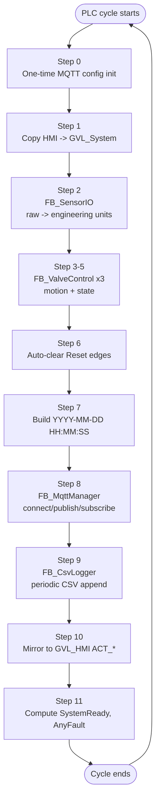

The numbered comments in `MAIN.TcPOU` line up with this diagram
exactly. Let's walk through each step.

### Step 0 — One-time MQTT config init

```iecst
IF NOT bMqttConfigInit THEN
    GVL_HMI.HMI_MQTT_Config.sBrokerAddress := GVL_Config.MQTT_DEFAULT_BROKER_IP;
    GVL_HMI.HMI_MQTT_Config.nPort          := GVL_Config.MQTT_DEFAULT_PORT;
    ...
    bMqttConfigInit := TRUE;
END_IF
```

`bMqttConfigInit` is a local boolean that defaults to FALSE, so
this block runs once at first scan after a download/reboot.
After that the operator can edit any of these from the HMI.

**Why not just initialise the config inline in the GVL?** Because
`HMI_MQTT_Config` is a runtime variable (operators edit it). The
GVL_Config defaults are CONSTANT. We seed the runtime copy on
first scan only.

### Step 1 — Copy HMI → GVL_System

```iecst
GVL_System.Valve[1].HMI_Setpoint := GVL_HMI.HMI_Valve1_Setpoint;
GVL_System.Valve[1].Reset_Cmd    := GVL_HMI.HMI_Valve1_Reset;
... (×3 valves)

IF GVL_HMI.HMI_ResetAll THEN
    GVL_System.Valve[1..3].Reset_Cmd := TRUE;
    GVL_HMI.HMI_ResetAll := FALSE;        // self-clear
END_IF
```

This step **decouples** the HMI from the FBs. The FBs only ever
read `GVL_System.Valve[n]`. They never look at `GVL_HMI` directly.

The MQTT setpoints are also wired in here:

```iecst
GVL_System.Valve[1].MQTT_Setpoint := fbMqttManager.rMqttValveSetpoint[1];
GVL_System.Valve[1].MQTT_Enabled  :=
    GVL_HMI.HMI_MQTT_bEnable AND          // master MQTT enable
    GVL_HMI.HMI_Valve1_MQTT_Enable AND    // per-valve checkbox
    fbMqttManager.bMqttValveEnable[1];    // per-command enable bit
```

The triple-AND for `MQTT_Enabled` is a deliberate safety pattern:
**MQTT can only override the valve when all three flags agree**.
The operator must consciously enable MQTT both globally and for
that specific valve, AND the incoming JSON must include the
matching `ValveN_Enable: true`.

### Step 2 — FB_SensorIO

```iecst
fbSensorIO(
    bEnable   := TRUE,
    rLpfAlpha := 0.1,                  // 10 % new sample / cycle
    stOut     => GVL_System.Sensors    // entire struct written here
);
```

That single call reads all raw inputs, scales them, filters them,
and writes the whole `ST_SensorData` struct out in one shot. We
do this **before** any FB that consumes sensor data.

### Steps 3–5 — Three FB_ValveControl calls

Each valve is a separate instance of `FB_ValveControl`. Identical
parameters except for the axis and HMI bindings. Pattern:

```iecst
fbValve1(
    Axis           := Axis_Valve1,
    HMI_Setpoint   := GVL_System.Valve[1].HMI_Setpoint,
    MQTT_Setpoint  := GVL_System.Valve[1].MQTT_Setpoint,
    MQTT_Enabled   := GVL_System.Valve[1].MQTT_Enabled,
    Reset          := GVL_System.Valve[1].Reset_Cmd,
    Move_Stop      := GVL_HMI.HMI_Valve1_Stop,
    UPDATE         := GVL_HMI.HMI_UPDATE,
    bHoming        := GVL_HMI.HMI_Valve1_Homing,
    ZeroPosition   := GVL_IO.bBottom_position_1,
    -- motion params from GVL_Config --

    Actual_Position => GVL_System.Valve[1].Actual_Position,
    State           => GVL_System.Valve[1].State,
    Source          => GVL_System.Valve[1].Source,
    IsHomed         => GVL_System.Valve[1].IsHomed,
    InPosition      => GVL_System.Valve[1].InPosition,
    IsFault         => GVL_System.Valve[1].IsFault,
    FaultCode       => GVL_System.Valve[1].FaultCode,
    rTarget_mm      => GVL_HMI.Raw_Valve1_Setpoint,
    rActual_mm      => GVL_HMI.Raw_Valve1_Position
);
```

Note `:=` = input assignment, `=>` = output assignment. The
output assignments write the FB's outputs directly into GVL
fields, so other FBs see them on the same cycle.

### Step 6 — Auto-clear Reset edges

```iecst
GVL_System.Valve[1].Reset_Cmd := FALSE;
GVL_HMI.HMI_Valve1_Reset      := FALSE;
... (×3)
```

Inside `FB_ValveControl`, `Reset` is detected with `R_TRIG`
(rising edge). After one cycle, the FB has consumed the edge.
We clear the variable here so the next press is a fresh edge.
Without this clear, holding the button would not work as a
single-press; releasing it wouldn't matter; the system would
look stuck.

### Step 7 — Build the timestamp string

`fbSysTime(bEnable := TRUE, dwCycle := 1)` reads the IPC's local
clock once per cycle. We then concatenate `YYYY-MM-DD HH:MM:SS`
manually because `SYSTEMTIME_TO_STRING` returns a slightly
different format than what the JSON consumers expect.

The zero-padding logic is the most error-prone part:

```iecst
sTempStr := UINT_TO_STRING(fbSysTime.systemTime.wMonth);
IF fbSysTime.systemTime.wMonth < 10 THEN
    sTempStr := CONCAT('0', sTempStr);   // '4' -> '04'
END_IF
```

### Step 8 — FB_MqttManager

The trickiest part is the **whole-array buffers**:

```iecst
aValveSetpoint[1] := GVL_System.Valve[1].Active_Setpoint;
aValveSetpoint[2] := GVL_System.Valve[2].Active_Setpoint;
aValveSetpoint[3] := GVL_System.Valve[3].Active_Setpoint;
... (same for aValveActual and aValveSource)

fbMqttManager(
    rValveSetpoint := aValveSetpoint,    // pass whole arrays
    rValveActual   := aValveActual,
    sValveSource   := aValveSource,
    ...
);
```

**Why this pattern?** TwinCAT does **not** allow per-element
array assignment inside an FB call's parameter list (you'd get
compile errors C0032/C0044/C0046/C0018). So we populate three
local ARRAY[1..3] variables first, then pass them as whole arrays.
This was a real bug fix (commit `465b80d`).

After the call:

```iecst
GVL_HMI.HMI_MQTT_ApplyConfig := FALSE;   // self-clear after edge
```

### Step 9 — FB_CsvLogger

```iecst
fbCsvLogger(
    bEnable      := GVL_HMI.HMI_CSV_Enable,
    bForceWrite  := GVL_HMI.WriteTrigger,
    tLogInterval := GVL_Config.CSV_LOG_INTERVAL_S,
    sBasePath    := GVL_Config.CSV_FILE_PATH,
    sPrefix      := GVL_Config.CSV_FILENAME_PREFIX,
    stValve      := GVL_System.Valve,    // whole array
    stSensors    := GVL_System.Sensors,
    ...
);

GVL_HMI.WriteTrigger := FALSE;   // self-clear like other edges
```

### Step 10 — Mirror to GVL_HMI

This is just `ACT_* := GVL_System.*` for everything the HMI
displays. Plus the `Source` enum gets translated into a STRING
because TcHMI text controls bind to strings, not enums:

```iecst
CASE GVL_System.Valve[1].Source OF
    E_ValveSource.MQTT: GVL_HMI.ACT_Valve1_SourceText := 'MQTT';
    E_ValveSource.HMI:  GVL_HMI.ACT_Valve1_SourceText := 'HMI';
    ELSE                GVL_HMI.ACT_Valve1_SourceText := 'NONE';
END_CASE
```

### Step 11 — System health flags

```iecst
GVL_System.AnyFaultActive :=
    GVL_System.Valve[1].IsFault OR
    GVL_System.Valve[2].IsFault OR
    GVL_System.Valve[3].IsFault;

GVL_System.SystemReady :=
    GVL_System.Valve[1].IsHomed AND
    GVL_System.Valve[2].IsHomed AND
    GVL_System.Valve[3].IsHomed AND
    NOT GVL_System.AnyFaultActive;
```

These two booleans drive the big "System Ready" lamp on the HMI.

---

## 8. FB_SensorIO — raw counts → engineering units

The sensors give us **raw INT counts** from the EtherCAT cards.
A water-level reading of `16383` is meaningless to a human; we
need it in millimetres. That's what this FB does.

```mermaid
flowchart LR
    subgraph In["GVL_IO (raw INT)"]
        a[AI_L1V11<br/>0..32767]
        b[AI_Tmp_1<br/>tenths °C]
        c[AI_Tmp_2]
        d[AI_PosFeedback_1..3]
    end

    subgraph FB["FB_SensorIO"]
        F[Fault detection<br/>raw <= -100 ?] --> S
        S[ScaleLinear method] --> L
        L[Low-pass filter<br/>y = α·x + (1-α)·y_prev] --> O
        O[Write outputs to<br/>ST_SensorData]
    end

    subgraph Out["GVL_System.Sensors"]
        e[rWaterLevel_mm]
        f[rWaterLevel_pct]
        g[rTemperature_C[1..2]]
        h[bAnySensorFault]
    end

    a --> F
    b --> F
    c --> F
    d --> F
    O --> e
    O --> f
    O --> g
    O --> h
```

### Sections inside the FB

The implementation has 6 numbered sections (search for
`SECTION 1` through `SECTION 6` in the file):

| Section | What it does                                            |
| ------: | ------------------------------------------------------- |
| 1       | Enable guard — if `bEnable=FALSE`, set fault flags, return |
| 2       | Fault detection — any raw ≤ `SENSOR_FAULT_THRESHOLD`     |
| 3       | Raw value capture — write raw counts for diagnostics     |
| 4       | Scale to engineering units (only when not faulted)       |
| 5       | Low-pass filter (with first-scan seeding)                |
| 6       | Write final values to `stOut`                            |

### The ScaleLinear method

A reusable utility that maps `raw` from `[rawMin, rawMax]` onto
`[engMin, engMax]`:

```iecst
result := engMin + (raw - rawMin) / (rawMax - rawMin) * (engMax - engMin);
```

Used both for water level (raw → mm) and supplementary position
feedback (raw → mm).

### Why a low-pass filter?

ADC readings are noisy — even a perfectly stable water level
might bounce ±5 counts. Without filtering, the displayed value
on the HMI would jitter and the CSV log would record meaningless
fluctuations.

The single-pole LPF formula is dead simple:

```text
y[n] = α · x[n]  +  (1 - α) · y[n-1]
```

| α value | Behaviour                                       |
| ------- | ----------------------------------------------- |
| 0.0     | Output never changes (filter is "stuck")        |
| 0.1     | 10 % new sample, 90 % history (default)         |
| 0.5     | Equal weight                                    |
| 1.0     | No filtering (pass-through)                     |

**First-scan seeding** is important — without it, the filter
would start from 0 and slowly approach the real reading over
many cycles, making the HMI "warm up" visibly. We seed `y[0]`
with the first raw reading to skip that transient.

### Fault detection

Each sensor has its own fault flag:

```iecst
stOut.bWaterLevelFault := GVL_IO.AI_L1V11 <= GVL_Config.SENSOR_FAULT_THRESHOLD;
```

`SENSOR_FAULT_THRESHOLD` defaults to `-100`. A disconnected
4-20 mA loop typically reads `-32768` or similar (driver
returns a negative sentinel). Setting the threshold at `-100`
gives a wide safety margin while still triggering on
disconnection.

The aggregate `bAnySensorFault` is an OR of all individual
flags and gets mirrored to the HMI as `ACT_SensorFault`.

---

## 9. FB_ValveControl — the 8-state motion machine

This is the **heart of the project** and the most important block
to understand before making any motion-related changes. It runs
once per valve, every PLC cycle.

### The state machine (mental model)

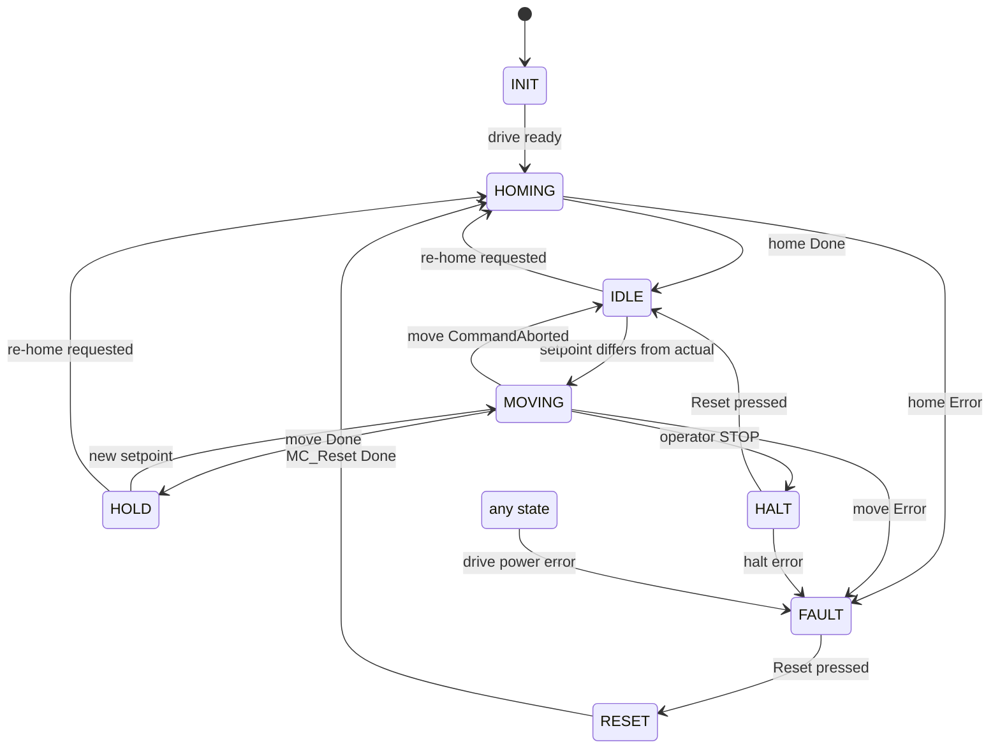

8 states, 1 happy path (`INIT → HOMING → IDLE → MOVING → HOLD`),
3 escape hatches (HALT, FAULT, RESET).

### Inputs / outputs at a glance

| Input            | Purpose                                          |
| ---------------- | ------------------------------------------------ |
| `Axis`           | NC axis reference (VAR_IN_OUT, must be linked)   |
| `HMI_Setpoint`   | 0–100 % from operator                            |
| `MQTT_Setpoint`  | 0–100 % from MQTT                                |
| `MQTT_Enabled`   | Gate flag from MAIN (master AND per-valve AND cmd) |
| `UPDATE`         | Rising edge: apply HMI setpoint                  |
| `Reset`          | Rising edge: clear fault, re-home                |
| `Move_Stop`      | Operator emergency halt                          |
| `bHoming`        | Rising edge: re-home request                     |
| `ZeroPosition`   | Limit switch / homing cam wired to GVL_IO        |

| Output             | Purpose                              |
| ------------------ | ------------------------------------ |
| `Actual_Position`  | 0–100 % current opening              |
| `State`            | E_ValveState (current state)         |
| `Source`           | E_ValveSource (HMI / MQTT / NONE)    |
| `IsHomed`          | TRUE after successful homing         |
| `InPosition`       | within tolerance of setpoint         |
| `IsFault` / `FaultCode` | error from MC2 FBs              |
| `rTarget_mm`       | active target in mm (for diagnostics) |
| `rActual_mm`       | actual position in mm                |

### Setpoint arbitration — how HMI vs MQTT priority works

This is one of the recently fixed bugs and is worth studying:

```iecst
// 1. MQTT (lower priority) — only when enabled and value changed
IF MQTT_Enabled AND (MQTT_Setpoint <> rPrev_MQTT_SP) THEN
    rActiveSetpoint := LIMIT(0.0, MQTT_Setpoint, 100.0);
    rPrev_MQTT_SP   := MQTT_Setpoint;
    Source          := E_ValveSource.MQTT;
END_IF

// 2. HMI (higher priority) — overrides MQTT on the same cycle
IF rtUpdate.Q THEN
    rActiveSetpoint := LIMIT(0.0, HMI_Setpoint, 100.0);
    rPrev_HMI_SP    := HMI_Setpoint;
    Source          := E_ValveSource.HMI;
END_IF
```

Why two `IF` blocks (not `IF...ELSIF`)? Because order of execution
**is** the priority. MQTT writes first; HMI writes second and
overwrites the result if the operator pressed Update on the same
cycle. The `Source` field tracks who won.

`rPrev_MQTT_SP` defaults to `-999.0` so the very first MQTT value
is always different and gets applied. Without this the FB would
ignore the first command.

### TC2_MC2 FB instances

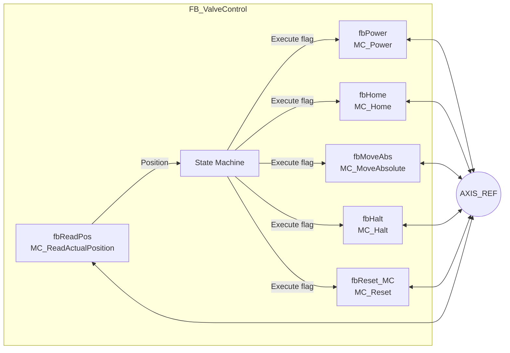

Each MC2 FB is called every cycle (so it can run its internal
logic), but only does work when its `Execute` input is TRUE.
That's the **PLCopen Execute pattern**:

1. State machine sets `bExecMove := TRUE` on entry to MOVING.
2. `MC_MoveAbsolute` sees the rising edge, starts the move.
3. When `Done` becomes TRUE, the state machine sets
   `bExecMove := FALSE` and calls the FB once more with FALSE
   to clean up. Then transitions out.

Look for this pattern in every state — it's repeated 5 times
(once per MC2 FB).

### State-by-state summary

| State   | Sets Execute… | Watches for…              | Goes to…                      |
| ------- | ------------- | ------------------------- | ----------------------------- |
| INIT    | clears all    | `bAxisReady`              | HOMING                        |
| HOMING  | `bExecHome`   | `Done`/`Error`            | IDLE / FAULT                  |
| IDLE    | clears Move   | `setpoint <> actual` / `bHoming` | MOVING / HOMING        |
| MOVING  | `bExecMove`   | `Done`/`Aborted`/`Error`/`Stop` | HOLD / IDLE / FAULT / HALT |
| HOLD    | clears Move   | `setpoint <> actual` / `bHoming` | MOVING / HOMING        |
| HALT    | `bExecHalt`   | `Done` / `Reset`          | IDLE                          |
| FAULT   | clears all    | `Reset` rising edge       | RESET                         |
| RESET   | `bExecReset`  | `Done`                    | HOMING                        |

### Position scaling (% ↔ mm)

The FB always works internally in **mm** because that's what
`MC_MoveAbsolute` expects:

```iecst
rTarget_mm := REAL_TO_LREAL(rActiveSetpoint / 100.0 * FullStroke_mm);
```

And converts feedback back to %:

```iecst
Actual_Position := LREAL_TO_REAL(rActual_mm / FullStroke_mm) * 100.0;
Actual_Position := LIMIT(0.0, Actual_Position, 100.0);
```

This is why **calibrating `VALVE_FULL_STROKE_MM`** is critical
before running the system. If that number is wrong, every
percentage on the HMI is wrong.

### Drive fault trap

There's a global guard outside the state machine:

```iecst
IF fbPower.Error AND
   eState <> FAULT AND eState <> RESET AND eState <> INIT THEN
    FaultCode := fbPower.ErrorID;
    eState    := FAULT;
END_IF
```

This catches *unexpected* drive faults from any running state
(e.g. a stepper stalls during a move) and routes them to FAULT
without needing a check in every individual state.

---

## 10. FB_MqttManager — broker connection + JSON

The MQTT manager is the bridge between the PLC and the outside
world. It does four things:

1. Manages the broker connection (with auto-reconnect)
2. Auto-subscribes to the command topic on every (re)connection
3. Parses incoming JSON commands → fills `rMqttValveSetpoint[]`
4. Builds outgoing JSON status → publishes on a timer or button

### Connection state machine

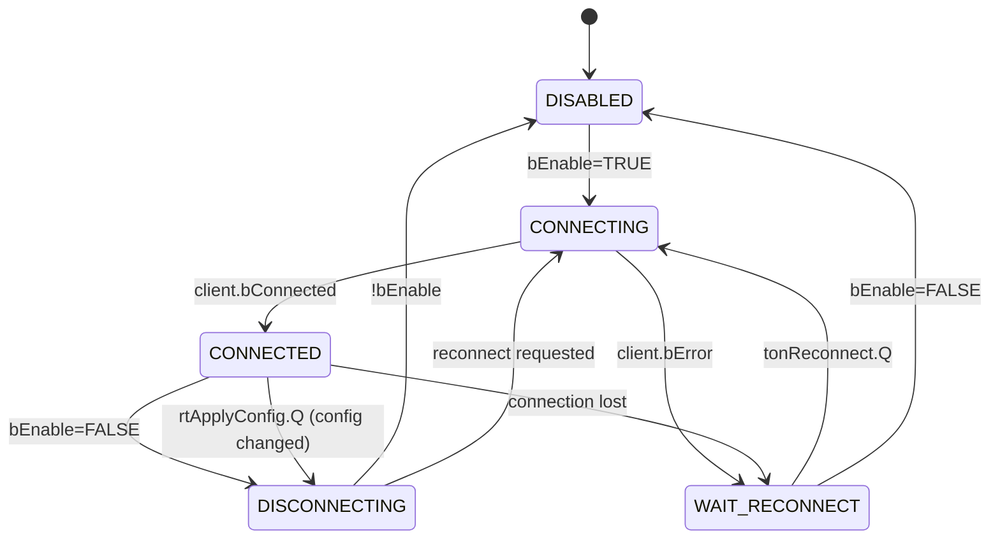

The `WAIT_RECONNECT` state uses a `TON` timer (default 5 s back-off)
to avoid hammering the broker if it's unreachable.

### Auto-subscribe pattern

A common bug pattern in MQTT clients: forgetting to re-subscribe
after a reconnection. This FB handles it cleanly:

```iecst
CONNECTED:
    bConnectCmd := TRUE;
    IF NOT bAutoSubscribed THEN
        bAutoSubscribed := fbMqttClient.Subscribe(
            sTopic := stConfig.SubscribeTopic,
            eQoS   := TcIotMqttQos.AtLeastOnceDelivery);
    END_IF
```

`bAutoSubscribed` is reset to FALSE every time we leave CONNECTED,
so the next entry into CONNECTED triggers a fresh subscribe.

### Incoming message processing

The Beckhoff IoT lib delivers received messages to a queue. We
drain the queue with a `WHILE` loop:

```iecst
WHILE fbMessageQueue.nQueuedMessages > 0 DO
    IF fbMessageQueue.Dequeue(fbMessage := fbMessage) THEN
        fbMessage.GetTopic(...);
        fbMessage.GetPayload(...);

        bSuccess := fbJsonDataType.SetSymbolFromJson(
            sPayloadRcv, 'ST_MQTT_COMMAND', SIZEOF(stCmdRecv), ADR(stCmdRecv));

        IF bSuccess THEN
            rMqttValveSetpoint[1] := LIMIT(0.0, DINT_TO_REAL(stCmdRecv.Valve1), 100.0);
            rMqttValveSetpoint[2] := LIMIT(0.0, DINT_TO_REAL(stCmdRecv.Valve2), 100.0);
            rMqttValveSetpoint[3] := LIMIT(0.0, DINT_TO_REAL(stCmdRecv.Valve3), 100.0);
            bMqttValveEnable[1]   := stCmdRecv.Valve1_Enable;
            bMqttValveEnable[2]   := stCmdRecv.Valve2_Enable;
            bMqttValveEnable[3]   := stCmdRecv.Valve3_Enable;
        END_IF
    END_IF
END_WHILE
```

Important details:

- `SetSymbolFromJson` is Beckhoff magic that walks the JSON and
  fills the matching struct fields by name. Any mismatch returns
  `bSuccess := FALSE` and we ignore the message.
- `LIMIT(0.0, x, 100.0)` clamps every received value — defence
  against malformed/malicious payloads.
- The Valve2/Valve3 indices were originally swapped (a real bug
  — see CHANGELOG.md). Now they correctly map 1→1, 2→2, 3→3.

### Outgoing JSON build

The `BuildStatusJson` method assembles a JSON string by hand:

```iecst
sTemp := '{';
sTemp := CONCAT(sTemp, '"timestamp":"');
sTemp := CONCAT(sTemp, sTimestamp);
sTemp := CONCAT(sTemp, '"');
sTemp := CONCAT(sTemp, ',"valve_1_setpoint":');
sTemp := CONCAT(sTemp, REAL_TO_STRING(rValveSetpoint[1]));
... (continues for each field)
sTemp := CONCAT(sTemp, '}');
sJsonStatusPayload := sTemp;
```

Why hand-built strings instead of a library? Because the JSON is
tiny and fixed-shape. Hand-building avoids the overhead of a DOM
builder for ~10 fields.

Sample output:

```json
{
  "timestamp": "2026-04-28 12:00:00",
  "valve_1_setpoint": 50.0, "valve_1_actual": 49.8, "valve_1_source": "HMI",
  "valve_2_setpoint": 25.0, "valve_2_actual": 25.1, "valve_2_source": "MQTT",
  "valve_3_setpoint": 75.0, "valve_3_actual": 74.9, "valve_3_source": "HMI",
  "temperature_c": 22.5, "water_level_pct": 65.3, "water_level_mm": 653.0
}
```

### Two publish triggers

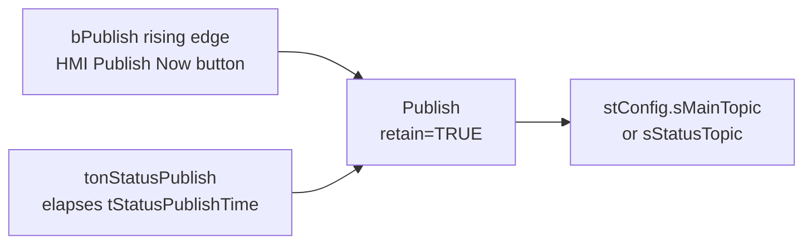

- **Manual publish** uses `bRetain := TRUE` so any new subscriber
  immediately gets the latest snapshot.
- **Cyclic publish** uses `bRetain := FALSE` because frequent
  retained messages would just churn the broker's storage.

### Reconnect on config change

When the operator clicks Apply & Reconnect, the FB:

1. Detects the rising edge (`rtApplyConfig.Q`)
2. Sets `bReconnectAfterDisconnect := TRUE`
3. Transitions to DISCONNECTING
4. Once disconnected, transitions back to CONNECTING with the new config

This ensures connection settings always reflect the current
config struct.

---

## 11. FB_CsvLogger — non-blocking file I/O

The CSV logger writes one row to disk every 15 minutes (configurable).
File I/O on a real-time PLC is **non-blocking** — each operation
spans many cycles, returning `bBusy := TRUE` until done. So we
need a state machine again.

### State machine

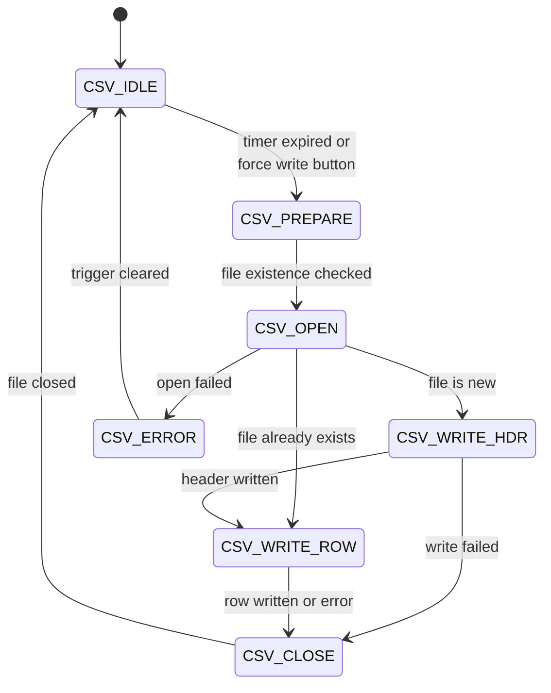

### Trigger logic

Two ways a write happens:

```iecst
bForceEdge(CLK := bForceWrite);
tIntervalTimer(IN := TRUE, PT := tLogInterval);
bTriggerWrite := tIntervalTimer.Q OR bForceEdge.Q;

IF tIntervalTimer.Q THEN
    tIntervalTimer(IN := FALSE);   // reset for next interval
END_IF
```

The `IN := FALSE` line resets the TON so it starts counting again
from zero on the next cycle. Without it, `Q` would stay TRUE and
we'd write a row every cycle (probably destroying the SD card
within a few hours).

### Filename rotation

Filenames include the year and month for monthly rotation:

```iecst
sCurrentFilename := CONCAT(sPrefix, sYear);                // 'IrrigationLog_2026'
sCurrentFilename := CONCAT(sCurrentFilename, '-');          // 'IrrigationLog_2026-'
sCurrentFilename := CONCAT(sCurrentFilename, sMonth);       // 'IrrigationLog_2026-04'
sCurrentFilename := CONCAT(sCurrentFilename, '.csv');       // 'IrrigationLog_2026-04.csv'
sCurrentFile     := CONCAT(sBasePath, sCurrentFilename);    // full path
```

When the calendar flips to May, the next write will go to
`IrrigationLog_2026-05.csv` automatically.

### File-existence check (decides header)

`FB_EnumFindFileEntry` is asked to find a file matching the
target name. If found, the file already exists → skip header.
If not, write the header row first.

```iecst
IF NOT fbEnum.bBusy THEN
    fbEnum(bExecute := FALSE);
    IF fbEnum.bError THEN
        bFileExists := FALSE;       // not found
    ELSE
        bFileExists := (fbEnum.stFindFile.sFileName <> '');
    END_IF
    eState := CSV_OPEN;
END_IF
```

### Row build (CSV_WRITE_ROW state)

```iecst
sLine := CONCAT(sTimestamp, ',');

CASE stValve[1].Source OF
    E_ValveSource.MQTT: sSource := 'MQTT';
    E_ValveSource.HMI:  sSource := 'HMI';
    ELSE                sSource := 'NONE';
END_CASE

sLine := CONCAT(sLine, REAL_TO_STRING(stValve[1].Active_Setpoint)); sLine := CONCAT(sLine, ',');
sLine := CONCAT(sLine, REAL_TO_STRING(stValve[1].Actual_Position)); sLine := CONCAT(sLine, ',');
sLine := CONCAT(sLine, sSource);                                    sLine := CONCAT(sLine, ',');
sLine := CONCAT(sLine, INT_TO_STRING(stValve[1].State));            sLine := CONCAT(sLine, ',');
... (repeat for valves 2 and 3, then sensors)
sLine := CONCAT(sLine, REAL_TO_STRING(stSensors.rTemperature_C[2])); sLine := CONCAT(sLine, '$R$N');
```

Note `$R$N` is the ST literal for `\r\n` (CRLF line ending —
Excel-friendly).

### Error recovery

If any file operation fails (disk full, permission, etc.), the
state machine goes to CSV_ERROR. It stays there until the next
trigger arrives, then retries from CSV_IDLE. The error flag
`bError` and `nErrorCode` are kept TRUE until the next successful
write, so a brief failure surfaces on the HMI for diagnosis.

---

## 12. End-to-end data flow

Three concrete scenarios — follow the data through the system.

### Scenario A: Operator moves Valve 1 to 50 %

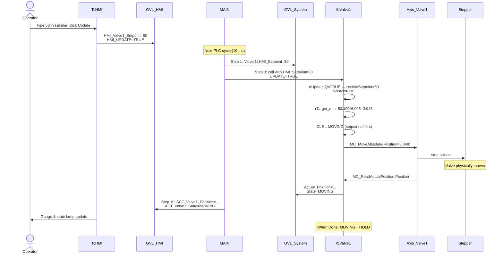

### Scenario B: Cloud sends MQTT command

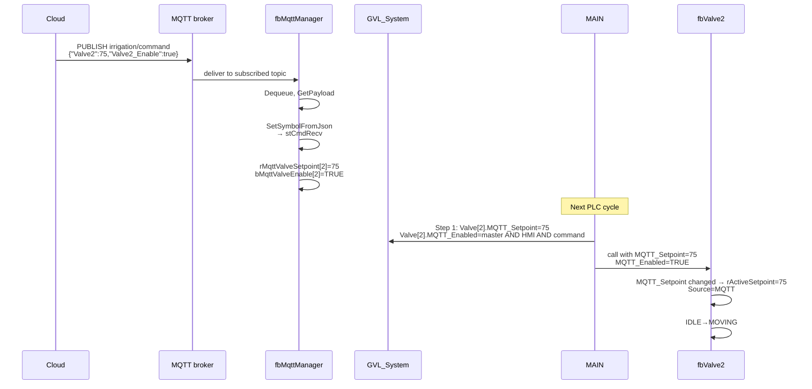

### Scenario C: Sensor reading flows to CSV row

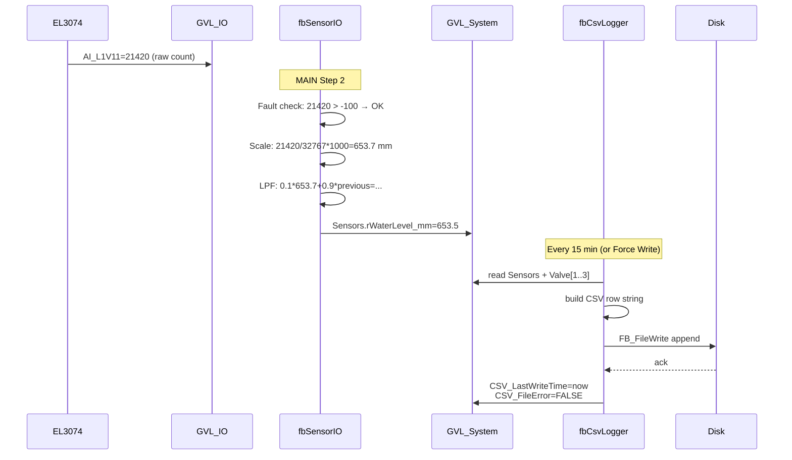

---

## 13. HMI interaction flow

The TcHMI dashboard binds controls to GVL_HMI variables via ADS.

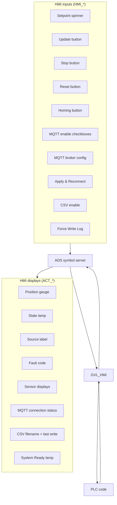

### Operator workflow — first run after install

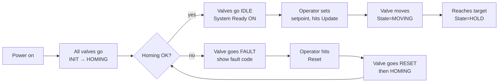

### Operator workflow — enabling MQTT

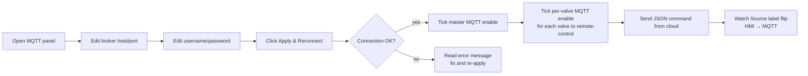

---

## 14. Cycle timing & determinism

### How often things run

```mermaid
gantt
    title One PLC cycle (10 ms task period)
    dateFormat X
    axisFormat %s ms

    section MAIN
    Step 0-1 HMI copy        :a1, 0, 1
    Step 2 SensorIO          :a2, after a1, 1
    Step 3-5 ValveControl ×3 :a3, after a2, 4
    Step 6-7 timestamp etc.  :a4, after a3, 1
    Step 8 MqttManager       :a5, after a4, 1
    Step 9 CsvLogger         :a6, after a5, 1
    Step 10-11 mirror+health :a7, after a6, 1
```

Numbers above are *typical* (in ms). The actual TwinCAT task
period is set in **Real-Time → Tasks → PlcTask → Cycle ticks**.
The default is 10 ms which gives plenty of margin.

### What CAN happen in one cycle

- Read all sensors, scale, filter
- Run all 3 valve state machines through their CASE statements
- Process the entire MQTT message queue (the WHILE loop)
- Move forward one step in the CSV state machine
- Mirror everything to the HMI

### What CANNOT happen in one cycle

- A single valve move (takes seconds — uses MOVING state across many cycles)
- An MQTT (re)connect (takes 100s of ms — uses CONNECTING state)
- A CSV write (takes 10s of ms across multiple state transitions)

This is why **everything is a state machine**. The PLC only gets
10 ms per cycle, so any operation longer than that must be split
across cycles by remembering progress in a state variable.

### Why MAIN's order matters

Sensor data flows to consumers, so `FB_SensorIO` must run **before**
the FBs that consume it (`FB_ValveControl` reads sensors? No — but
`FB_MqttManager` includes them in JSON, and `FB_CsvLogger` puts
them in the row). Ordering within one cycle:

```text
FB_SensorIO  →  produces Sensors
FB_ValveControl  →  produces Valve[n]
FB_MqttManager  →  consumes Sensors + Valve[n], publishes
FB_CsvLogger    →  consumes Sensors + Valve[n], logs
```

If you reorder, you'll just get one cycle of stale data — not
catastrophic, but easy to avoid.

---

## 15. How to make common changes

### Change A: Add a 4th valve

This is the biggest change but the easiest to follow because
every existing valve is a template.

```mermaid
flowchart TB
    A[1. Wire 4th EPP7041 drive<br/>+ limit switch in hardware] --> B
    B[2. TwinCAT MOTION:<br/>Add Axis_Valve4 NC axis] --> C
    C[3. GVL_System: change<br/>Valve : ARRAY[1..4] OF ST_ValveData] --> D
    D[4. GVL_HMI: add HMI_Valve4_*<br/>and ACT_Valve4_* variables] --> E
    E[5. MAIN: declare fbValve4<br/>+ Axis_Valve4 + arrays size 1..4] --> F
    F[6. MAIN: copy step 1 / step 5<br/>and step 10 patterns for valve 4] --> G
    G[7. ST_MQTT_Command: add<br/>Valve4 + Valve4_Enable fields] --> H
    H[8. FB_MqttManager: extend<br/>arrays + JSON build for valve 4] --> I
    I[9. FB_CSVLogger: add valve 4<br/>columns to header + row build] --> J
    J[10. HMI: copy valve 1 panel<br/>change bindings to valve 4] --> K
    K[Build, download, test]
```

### Change B: Calibrate `VALVE_FULL_STROKE_MM`

Without this, every percentage is wrong. Measure the actuator's
true mechanical travel, then:

1. Edit `GVL_Config.VALVE_FULL_STROKE_MM := <new value>`
2. Build and download
3. Verify a 50 % command moves the valve to half its travel

### Change C: Add a new sensor

Example: a flow meter on EL3074 ch4.

1. `GVL_IO`: add `AI_FlowMeter AT %I* : INT;` and link it
2. `GVL_Config`: add scaling constants
   `FLOW_RAW_MIN/MAX/ENG_MIN/ENG_MAX_LPM`
3. `ST_SensorData`: add `rFlow_LPM : REAL; bFlowFault : BOOL;`
4. `FB_SensorIO`: add fault check + `ScaleLinear` + LPF + write
5. `GVL_HMI`: add `ACT_Flow_LPM : REAL;`
6. `MAIN` step 10: mirror it
7. (optional) Add to MQTT JSON in `FB_MqttManager.BuildStatusJson`
8. (optional) Add column in `FB_CsvLogger`

### Change D: Change the publish interval

This is purely runtime — no code changes. Operator opens the
MQTT panel on the HMI, edits the publish-interval field,
clicks Apply & Reconnect.

If you want a different **default**, edit
`GVL_Config.MQTT_DEFAULT_PUBLISH_INTERVAL` (in seconds). New
defaults take effect next time the PLC starts cold (or after
deleting persistent data).

### Change E: Change CSV log interval

```iecst
// GVL_Config.TcGVL
CSV_LOG_INTERVAL_S : TIME := T#5M;   // was T#15M
```

Build, download. Done.

### Change F: Add a new MQTT command field

Example: a "PauseAll" boolean.

1. `ST_MQTT_Command`: add `PauseAll : BOOL;`
2. `FB_MqttManager` (after `bSuccess` block): add
   `bPauseAll := stCmdRecv.PauseAll;`
3. Add `bPauseAll : BOOL;` to VAR_OUTPUT
4. `GVL_System`: add `MQTT_PauseAll : BOOL;`
5. `MAIN`: wire output to GVL, then use it (e.g. as `Move_Stop`)
6. Send `{"PauseAll": true}` via MQTT to test

### Change G: Tighten or loosen position tolerance

```iecst
// GVL_Config.TcGVL
VALVE_POSITION_TOLERANCE : REAL := 0.2;   // was 0.5 (%)
```

Smaller value = tighter positioning but more time spent in
MOVING state hunting for exact target. Bigger value = faster
IDLE/HOLD transitions but less precise.

### Change H: Add a remote "trigger CSV write" via MQTT

1. `ST_MQTT_Command`: add `ForceLog : BOOL;`
2. `FB_MqttManager`: parse it, expose `bForceLog` output
3. `MAIN`: `GVL_HMI.WriteTrigger := GVL_HMI.WriteTrigger OR fbMqttManager.bForceLog;`

The OR means either source can trigger a write.

---

## 16. Glossary of ST / PLCopen terms

| Term                  | Meaning                                                                |
| --------------------- | ---------------------------------------------------------------------- |
| **POU**               | Program Organisation Unit — generic name for PROGRAM / FB / FUNCTION   |
| **PROGRAM**           | A single instance, called once per cycle (e.g. MAIN)                   |
| **FUNCTION_BLOCK (FB)** | A reusable class — instantiate as many times as needed                |
| **VAR_INPUT / VAR_OUTPUT** | Input / output parameters of an FB                                |
| **VAR_IN_OUT**        | Reference parameter (passed by reference, e.g. `AXIS_REF`)             |
| **GVL**               | Global Variable List — variables visible to every POU                  |
| **DUT**               | Data Unit Type — user-defined enum or struct                           |
| **TcPOU / TcDUT / TcGVL** | TwinCAT XML wrappers around the actual ST source                  |
| **`AT %I*`**          | "Auto-link this variable to a hardware input"                          |
| **`AT %Q*`**          | "Auto-link this variable to a hardware output"                         |
| **R_TRIG**            | Rising-edge detector. Output `Q` is TRUE for one cycle on a 0→1 change |
| **F_TRIG**            | Falling-edge detector                                                  |
| **TON**               | "Timer On Delay" — `Q` becomes TRUE after `IN` has been TRUE for `PT`  |
| **AXIS_REF**          | Reference to an NC axis — links PLC to motion configuration            |
| **MC_xxx**            | Motion Control function blocks from TC2_MC2 (`MC_Power`, `MC_Home`, etc.) |
| **PLCopen Execute**   | A standard pattern: rising edge of `Execute` starts the operation; FB clears `Done` when `Execute` returns FALSE |
| **`Execute` / `Done`** | Standard inputs/outputs on most MC2 FBs                              |
| **CASE / END_CASE**   | ST's switch statement; we use it for state machines                    |
| **ENO / EN**          | Standard "enable input/output" on functions (rarely used here)         |
| **CONCAT**            | String concatenation function                                          |
| **LIMIT(min, x, max)** | Clamp x into [min, max]                                               |
| **`$R$N`**            | ST literal for `\r\n` (CRLF line ending)                              |
| **HRESULT**           | Beckhoff IoT error code (32-bit; 0 = OK, negative = error)             |
| **ADS**               | Beckhoff's PLC-to-host messaging protocol (used by HMI)                |

### Conventions used in this codebase

| Convention                    | Where                       |
| ----------------------------- | --------------------------- |
| `fb<Name>` for FB instances   | `fbValve1`, `fbMqttClient`  |
| `r<Name>` for REAL values     | `rActiveSetpoint`           |
| `b<Name>` for BOOL values     | `bExecMove`, `bConnected`   |
| `s<Name>` for STRING values   | `sTimestamp`, `sBrokerAddress` |
| `n<Name>` for INT/UINT/UDINT  | `nPort`, `nErrorCode`       |
| `e<Name>` for enum values     | `eState`                    |
| `st<Name>` for struct values  | `stConfig`, `stCmdRecv`     |
| `rt<Name>` for R_TRIG instances | `rtUpdate`, `rtReset`     |
| `ton<Name>` for TON instances | `tonReconnect`              |

Apply these whenever you add a new variable — it makes the code
self-documenting.

---

## Where to go next

1. **Run it once** — follow `docs/SETUP.md` end-to-end.
2. **Read MAIN.TcPOU** with this document open — every step
   should make sense now.
3. **Try a small change** — e.g. tighten position tolerance, see
   the effect.
4. **Try a bigger change** — pick one of the recipes in section
   15 and work through it.
5. **Make it your own** — every FB has a comment header explaining
   its job. Read those, then read the implementation. Update the
   header when you change the behaviour.

Happy hacking!
