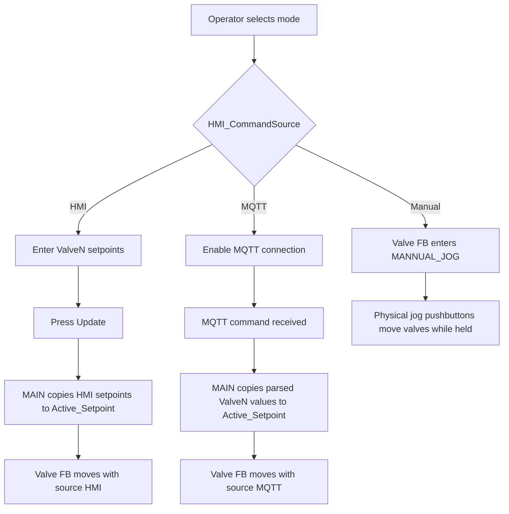
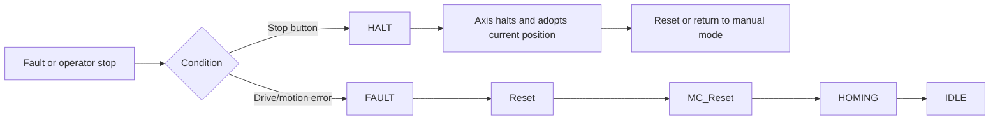

# HMI Flow

## Development-HMI status

The current `HMI/Desktop.view` and the attached screenshot are a **test/development HMI**, not the final production operator screen. The layout is intended to validate ADS bindings, mode selection, MQTT behavior, CSV logging, EtherCAT diagnostics, and manual/jog signals during development.

## Main areas in the current test HMI

| Area | Purpose | Key PLC symbols |
| --- | --- | --- |
| Valve setpoint/position rows | Enter HMI setpoints, show actual positions, stop/home valves | `HMI_ValveN_Setpoint`, `ACT_ValveN_Position`, `HMI_ValveN_Stop`, `HMI_ValveN_Homing` |
| Update/reset buttons | Apply HMI source setpoints or reset commands | `HMI_UPDATE`, `HMI_ValveN_Reset`, `HMI_ResetAll` |
| CSV/file area | Force CSV write and inspect log files during testing | `WriteTrigger`, `ACT_CSV_CurrentFile`, `ACT_CSV_Error` |
| MQTT area | Enable/disable MQTT and publish a status payload manually | `HMI_MQTT_bEnable`, `HMI_MQTT_mPublish`, `ACT_MQTT_*` |
| Mode selection | Select system command authority | `HMI_CommandSource`, `sHMI_mode`, `sMqtt_mode`, `sMannual_mode` |
| Manual valve panel | Test manual/jog indicators for each valve | `GVL_IO.bValveN_JogUp_PB`, `bValveN_JogDown_PB`, `bValveN_JogUp_LED`, `bValveN_JogDown_LED` |
| EtherCAT diagnostics | Development view of terminals/drives | TwinCAT HMI EtherCAT diagnostics controls |

## Mode workflow



## HMI setpoint workflow

1. Select **HMI** mode.
2. Enter desired `0–100 %` setpoints for one or more valves.
3. Press **Update** (`HMI_UPDATE`).
4. `MAIN` copies the setpoints to `GVL_System.Valve[N].Active_Setpoint`.
5. Each valve FB converts percent to mm using `VALVE_FULL_STROKE_MM` and moves when outside tolerance.

When the system switches into HMI mode, `MAIN` copies the current actual positions into the HMI setpoint boxes so the operator starts from the current valve positions instead of stale setpoints.

## MQTT workflow

1. Configure broker fields in `HMI_MQTT_Config` if needed.
2. Enable MQTT with `HMI_MQTT_bEnable`.
3. Press Apply/Reconnect if config changed.
4. Select **MQTT** command source.
5. Publish command JSON to `SubscribeTopic`.
6. Watch `ACT_MQTT_State`, `ACT_MQTT_LastRxTopic`, `ACT_MQTT_NewCommand`, source text, and actual position displays.

## Manual/jog workflow

1. Select **Manual** command source.
2. Each valve FB transitions into `MANNUAL_JOG` from normal states.
3. Use the physical jog up/down pushbuttons.
4. Jog up is blocked at the top limit; jog down is blocked at the bottom/zero limit.
5. Jog LEDs blink while jogging and stay solid at the corresponding limit.
6. Leaving Manual mode adopts the current actual position as the next held target before returning to normal automatic states.

## Fault / stop recovery



## Binding reference

All current controls should bind through ADS symbols under:

```text
%s%ADS.PLC1.GVL_HMI.<VariableName>%/s%
```

Use `GVL_IO` symbols only for hardware-test/jog-panel inputs and outputs. Production HMI controls should prefer `GVL_HMI` so `MAIN` remains the single coordinator.
