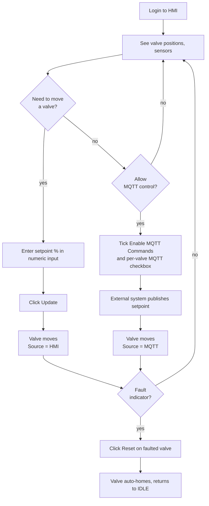
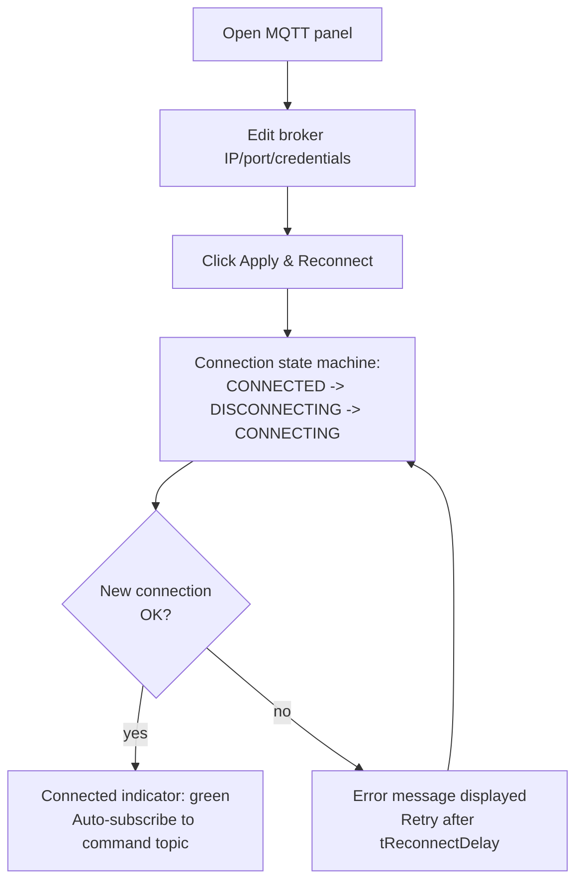
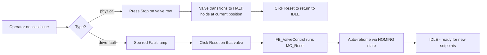

# HMI Flow

The HMI is a single TcHMI view (`HMI/Desktop.view`) that exposes
all operator controls and runtime status.

## Screen layout

```text
+------------------------------------------------------------+
| VALVES                                                     |
| ----------------------------------------------------------|
| Valve 1: [setpoint input]  [position display]  [Stop] [Homing] [Source: HMI/MQTT]  [MQTT]
| Valve 2: [setpoint input]  [position display]  [Stop] [Homing] [Source: HMI/MQTT]  [MQTT]
| Valve 3: [setpoint input]  [position display]  [Stop] [Homing] [Source: HMI/MQTT]  [MQTT]
|                                                            |
| [Update]   [Reset All]                System Ready: Y/N    |
| ----------------------------------------------------------|
| SENSORS                                                    |
| Water Level (mm): [val]    Water Level (%): [val]          |
| Temperature 1   : [val]    Temperature 2   : [val]         |
| ----------------------------------------------------------|
| MQTT                                                       |
| [x] Enable MQTT Commands     Connected: Y    [error msg]   |
| Broker: [----]   Port: [----]                              |
| Username: [----] Password: [****]                          |
| Pub Topic: [----]   Sub Topic: [----]                      |
| [Apply & Reconnect]   [Publish Now]                        |
| ----------------------------------------------------------|
| LOGGING                                                    |
| [x] CSV Logging Enabled                                    |
| Current file: IrrigationLog_2026-04.csv                    |
| [Force Write Log]                                          |
+------------------------------------------------------------+
```

> **Note:** the Desktop.view file as shipped places the new
> controls programmatically. Open the view in TcHMI Engineering
> after import to fine-tune positioning.

## Operator workflow



## MQTT broker setup workflow



## Emergency stop / fault recovery



## HMI symbol bindings reference

All controls bind to `GVL_HMI` symbols via the ADS bridge:

`%s%ADS.PLC1.GVL_HMI.<VariableName>%/s%`

| HMI control type        | GVL_HMI variable family             |
| ----------------------- | ----------------------------------- |
| Numeric input (setpoint)| `HMI_ValveN_Setpoint`               |
| Numeric input (port)    | `HMI_MQTT_Config.nPort`             |
| Textbox                 | `HMI_MQTT_Config.s*`                |
| Checkbox                | `HMI_MQTT_bEnable`, `HMI_ValveN_MQTT_Enable`, `HMI_CSV_Enable` |
| Button (momentary)      | `HMI_*_Reset`, `HMI_*_Homing`, `HMI_UPDATE`, `HMI_MQTT_mPublish`, `HMI_MQTT_ApplyConfig`, `WriteTrigger` |
| Read-only display       | `ACT_*` family                      |
