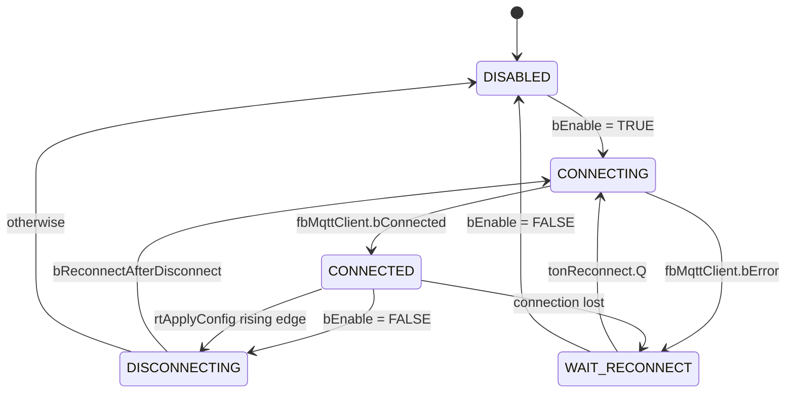
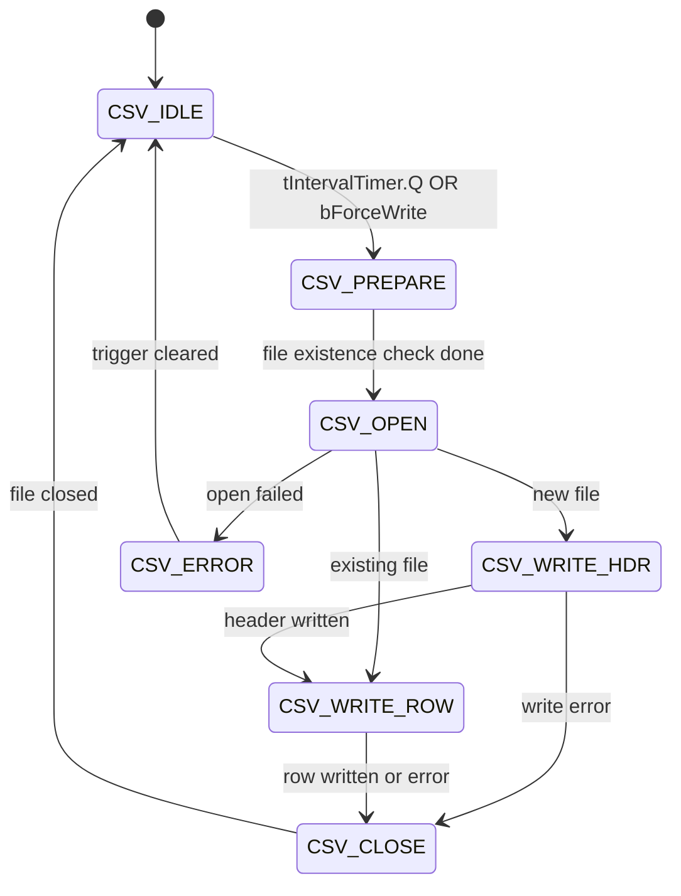

# State Machines

This project contains three explicit state machines.
All transitions are documented inline in the corresponding `.TcPOU`.

---

## 1. FB_ValveControl (per valve)

8 states implemented in `Functions/FB_ValveControl.TcPOU` (SECTION 5).

```mermaid
stateDiagram-v2
    [*] --> INIT
    INIT --> HOMING: bAxisReady = TRUE
    HOMING --> IDLE: fbHome.Done
    HOMING --> FAULT: fbHome.Error
    IDLE --> MOVING: setpoint changed AND IsHomed
    IDLE --> HOMING: bHoming rising edge
    MOVING --> HOLD: fbMoveAbs.Done
    MOVING --> IDLE: fbMoveAbs.CommandAborted
    MOVING --> FAULT: fbMoveAbs.Error
    MOVING --> HALT: Move_Stop = TRUE
    HOLD --> MOVING: setpoint changed
    HOLD --> HOMING: bHoming rising edge
    HALT --> IDLE: rtReset.Q
    HALT --> FAULT: fbHalt.Error
    FAULT --> RESET: rtReset.Q
    RESET --> HOMING: fbReset_MC.Done
    state INIT { description: Clear flags, wait for drive ready }
    state HOMING { description: MC_Home to position 0.0 }
    state IDLE { description: Watch for setpoint or homing }
    state MOVING { description: MC_MoveAbsolute in progress }
    state HOLD { description: At target, monitoring }
    state HALT { description: MC_Halt graceful stop }
    state FAULT { description: Latched, awaiting Reset }
    state RESET { description: MC_Reset then re-home }
```

### Transition triggers

| From   | To     | Trigger                             |
| ------ | ------ | ----------------------------------- |
| INIT   | HOMING | `bAxisReady` (drive powered, no error) |
| HOMING | IDLE   | `fbHome.Done`                       |
| HOMING | FAULT  | `fbHome.Error`                      |
| IDLE   | MOVING | New setpoint outside tolerance band |
| IDLE   | HOMING | `rtHoming.Q` (HMI Homing button)    |
| MOVING | HOLD   | `fbMoveAbs.Done`                    |
| MOVING | IDLE   | `fbMoveAbs.CommandAborted`          |
| MOVING | FAULT  | `fbMoveAbs.Error`                   |
| MOVING | HALT   | `Move_Stop` (operator STOP)         |
| HOLD   | MOVING | New setpoint outside tolerance      |
| HOLD   | HOMING | `rtHoming.Q`                        |
| HALT   | IDLE   | `rtReset.Q`                         |
| FAULT  | RESET  | `rtReset.Q`                         |
| RESET  | HOMING | `fbReset_MC.Done`                   |

A drive error in any non-FAULT/RESET/INIT state forces a transition
to FAULT (caught at the top of the cyclic code, SECTION 3).

---

## 2. FB_MqttManager

5 states implemented in `Functions/FB_MqttManager.TcPOU`.



When entering `CONNECTED`, the FB **automatically subscribes** to
`stConfig.SubscribeTopic` once per connection. No external trigger
required.

The `bApplyConfig` rising edge causes a clean disconnect-reconnect
cycle so the new broker settings take effect.

---

## 3. FB_CsvLogger

7 states implemented in `Functions/FB_CSVLogger.TcPOU`.



### Trigger sources

- **Timer** (`tLogInterval`, default 15 minutes from `GVL_Config`)
- **Manual** (`bForceWrite` rising edge from HMI "Force Write Log")

### File rotation

Filename pattern: `IrrigationLog_YYYY-MM.csv` (monthly rotation).
A new file is automatically created at the start of each month.
On the first write to a new file, the header row is written before
any data rows.
