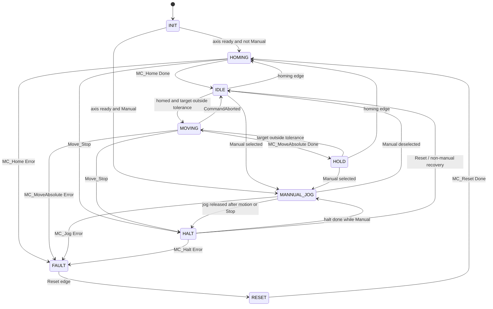
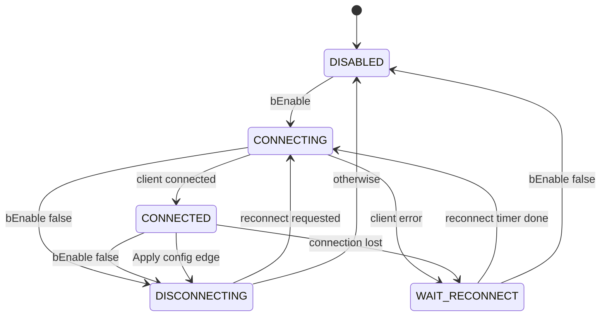
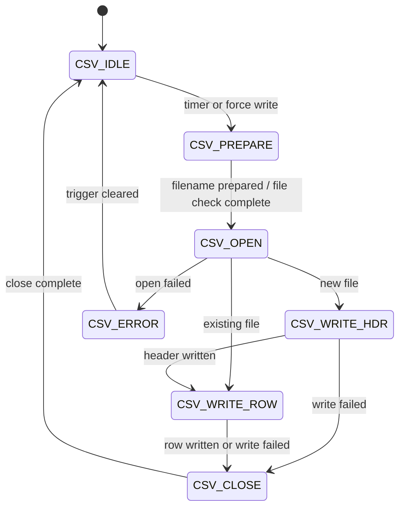

# State Machines

## `FB_ValveControl`

`FB_ValveControl` implements the valve motion state machine with TC2_MC2 function blocks, physical limit inputs, and manual jog handling.

### Valve states

| State | Value | Main behavior |
| --- | ---: | --- |
| `INIT` | 0 | Clears execute flags and waits for drive power/status. |
| `HOMING` | 1 | Runs `MC_Home` using the configured homing mode and zero-position input. |
| `IDLE` | 2 | Waits for a target change or homing request. |
| `MOVING` | 3 | Runs `MC_MoveAbsolute` to `rTarget_mm`. |
| `HALT` | 4 | Runs `MC_Halt`, adopts actual position as held target. |
| `HOLD` | 5 | Holds at target and watches for target changes. |
| `MANNUAL_JOG` | 6 | Manual hardware-panel jog mode. Name is spelled this way in the current enum/code. |
| `FAULT` | 7 | Latched fault; waits for reset. |
| `RESET` | 8 | Runs `MC_Reset`; then re-homes. |

### Manual jog rules

- Manual mode is selected by `currentcommandsrc = E_CommandSource.Manual`.
- Jog up requires Manual mode, jog-up pressed, jog-down not pressed, no top limit, and no fault.
- Jog down requires Manual mode, jog-down pressed, jog-up not pressed, no zero/bottom limit, and no fault.
- LEDs blink while jogging and are solid on at their corresponding limit.

## `FB_MqttManager`

| State | Behavior |
| --- | --- |
| `DISABLED` | Clears connect command and waits for MQTT enable. |
| `CONNECTING` | Applies host, port, client ID, credentials, TLS fields, and executes the MQTT client. |
| `CONNECTED` | Maintains connection, auto-subscribes once, handles config changes/dropouts. |
| `DISCONNECTING` | Executes client with connect command false until disconnected. |
| `WAIT_RECONNECT` | Waits `tReconnectDelay` before retrying. |

## `FB_CsvLogger`

| State | Behavior |
| --- | --- |
| `CSV_IDLE` | Waits for interval timer or forced-write edge. |
| `CSV_PREPARE` | Builds `IrrigationLog_YYYY-MM.csv` and checks if it exists. |
| `CSV_OPEN` | Opens the file in append mode. |
| `CSV_WRITE_HDR` | Writes the header for new files. |
| `CSV_WRITE_ROW` | Builds and writes one data row. |
| `CSV_CLOSE` | Closes file handle. |
| `CSV_ERROR` | Reports error and waits for next trigger cycle. |
